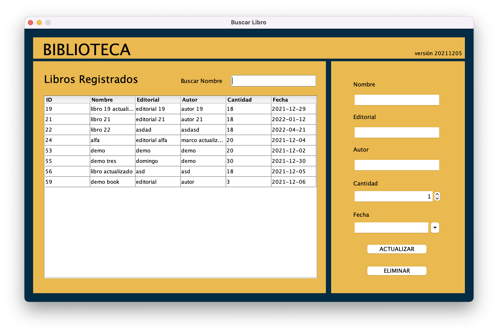
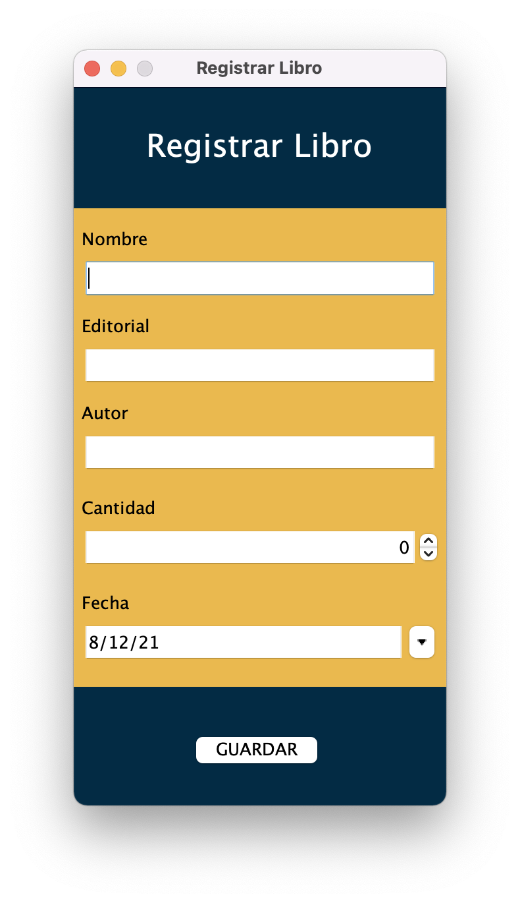
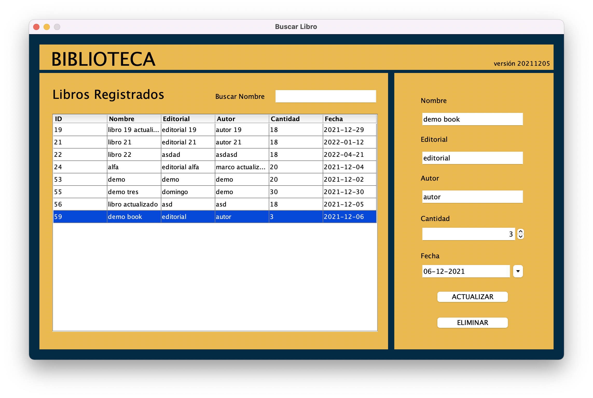
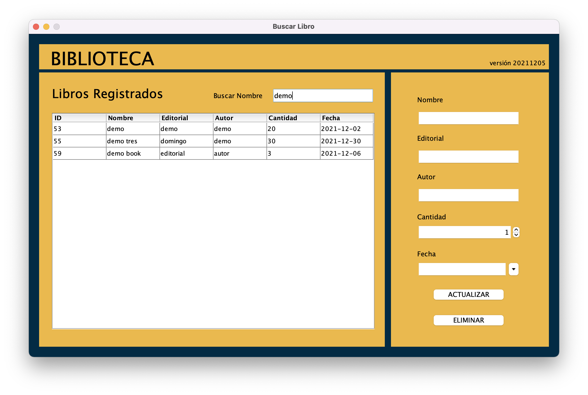

# Biblioteca

## Características y Funcionalidades

Patrón de Arquitectura MVC

###  Listar



### Registrar



### Actualizar o Eliminar



### Buscar
 
  


## Iniciar base de datos

- Instalar [docker](https://www.docker.com/)
- Configurar credenciales en archivo .env
- Iniciar Base de Datos MySQL [docker compose](https://docs.docker.com/compose/) ```docker-compose up -d``` 
 

 ## Iniciar proyecto netbeans

 - Instalar librerias .jar
   -  mysql-connector-java-8.0.25.jar (conectar java con mysql)
   -  swingx-0.9.5-2.jar (datepicker)
 - Configurar archivo ConexionModel.java con las credenciales utilizadas en el archivo .env
 - Ejecutar proyecto en netbeans


